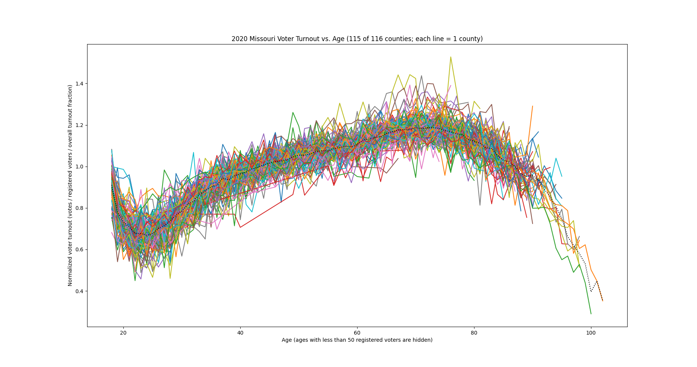

# Voting Machine Fraud in the State of Missouri

This exposes the pattern between voter turnout and age caused by attempted voting machine fraud in Missouri in the 2020 General Presidential Election.

## Results

Voter turnout vs. age clearly converge to some common curve, which is different from other states.

## Setup

Requires python3. Before running, be sure you have enough free space for the downloaded and decompressed CSV files, about 2 GB.

## Running

1. Download voter registration database (see 'Data Source' section).
2. Move and rename decompressed file to `./data/voters.txt`.
3. To plot voter turnout lines vs. age for all counties on the same plot: `./plot_turnout_by_age.py`.

## Data Source

Missouri requires an application and $35.00 fee to download their voter list.

You will need to send an email to `elections@sos.mo.gov` to start the process.
